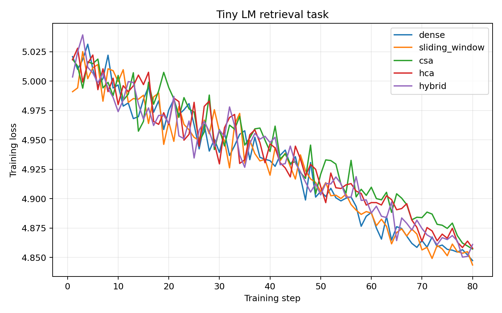

# Final GPU Experiment Results

These results were regenerated from a clean `outputs/` directory on April 29, 2026 using one NVIDIA GeForce RTX 3090. They are reference measurements for this pure PyTorch implementation, not official DeepSeek results and not production-kernel performance claims.

## Run Configuration

Attention benchmark:

```bash
python scripts/run_attention_benchmark.py \
  --device cuda \
  --dtype float16 \
  --seq-len 512,1024,2048,4096,8192 \
  --batch-size 1 \
  --hidden-size 128 \
  --num-heads 4 \
  --compression-ratio 4 \
  --hca-compression-ratio 16 \
  --top-k 8 \
  --window-size 128 \
  --iters 5 \
  --seed 1234 \
  --output-dir outputs
```

Tiny LM local task:

```bash
python scripts/run_tiny_lm_experiment.py \
  --device cuda \
  --dtype float32 \
  --attention all \
  --task local \
  --seq-len 256 \
  --batch-size 8 \
  --hidden-size 96 \
  --num-heads 4 \
  --num-layers 2 \
  --compression-ratio 4 \
  --hca-compression-ratio 16 \
  --top-k 8 \
  --window-size 64 \
  --steps 80 \
  --val-batches 8 \
  --seed 2026 \
  --output-dir outputs/tiny_lm/local_all_gpu
```

Tiny LM retrieval task:

```bash
python scripts/run_tiny_lm_experiment.py \
  --device cuda \
  --dtype float32 \
  --attention all \
  --task retrieval \
  --seq-len 256 \
  --batch-size 8 \
  --hidden-size 96 \
  --num-heads 4 \
  --num-layers 2 \
  --compression-ratio 4 \
  --hca-compression-ratio 16 \
  --top-k 8 \
  --window-size 64 \
  --steps 80 \
  --val-batches 8 \
  --seed 2027 \
  --output-dir outputs/tiny_lm/retrieval_all_gpu
```

## Attention Benchmark Summary

The full benchmark data is available in [attention_benchmark_gpu.csv](attention_benchmark_gpu.csv) and [attention_benchmark_gpu.json](attention_benchmark_gpu.json).

| attention | seq_len | runtime_ms | peak_memory_mb | kv_cache_mb | score_count |
|---|---:|---:|---:|---:|---:|
| dense | 8192 | 15.36 | 3155.35 | 4.00 | 268435456 |
| sliding_window | 8192 | 16.40 | 3156.35 | 0.06 | 4227072 |
| csa | 8192 | 20.02 | 3159.22 | 0.31 | 4489216 |
| hca | 8192 | 17.97 | 3190.63 | 0.13 | 21004288 |
| hybrid | 8192 | 37.92 | 3192.77 | 0.44 | 25493504 |


## Tiny LM Summary

The validation-loss summary is available in [tiny_lm_validation_gpu.csv](tiny_lm_validation_gpu.csv).

| task | dense | sliding_window | csa | hca | hybrid |
|---|---:|---:|---:|---:|---:|
| local | 2.3013 | 2.2982 | 2.2866 | 2.2699 | 2.2827 |
| retrieval | 4.8507 | 4.8501 | 4.8657 | 4.8596 | 4.8548 |




## Conclusion

The benchmark confirms the main scaling behavior that this repository is designed to expose. Dense attention has the largest attention-score count, reaching 268.4M scores at sequence length 8192. CSA reduces that score count to 4.49M at the same length, and sliding-window attention is similarly small at 4.23M. HCA sits between these extremes at 21.0M scores because it uses dense attention over a heavily compressed sequence.

Wall-clock runtime does not follow the theoretical score-count reduction in this reference implementation. Dense attention remains fastest in several cases because PyTorch dense matrix multiplication is highly optimized, while CSA and HCA use readable reference gather, masking, compression, and branch-merging code. This is expected for a pure PyTorch educational implementation and should not be interpreted as evidence about optimized CSA/HCA kernels.

The KV-cache estimates show the intended memory trend more clearly. At sequence length 8192, dense attention estimates 4.00 MB of KV cache for this small configuration, while sliding-window attention estimates 0.06 MB, CSA estimates 0.31 MB, HCA estimates 0.13 MB, and the toy hybrid estimates 0.44 MB.

The tiny LM experiments are sanity checks rather than model-quality evaluations. On the local task, all attention types learn quickly over 80 steps, with HCA producing the lowest validation loss in this run. On the retrieval task, losses remain close across attention types after only 80 steps, which suggests that this synthetic setup and training budget are too small to strongly separate long-range retrieval behavior.

Overall, these results support the repository's role as a research/reference lab. The implementation makes compression, sparse selection, local attention, and hybrid designs easy to inspect and compare, while leaving production performance to future optimized kernel work.

