# Latest GPU Experiment Results

These results were regenerated on May 7, 2026 using one NVIDIA GeForce RTX 3090 and PyTorch 2.3.1+cu121. They replace the previous result snapshot. The code is a pure PyTorch reference implementation, so runtime numbers should not be read as optimized DeepSeek kernel performance.

## Run Configuration

Suite command:

```bash
python scripts/run_3090_experiment_suite.py --profile standard --device cuda --output-root outputs/latest_suite
```

Benchmark command emitted by the suite:

```bash
python scripts/run_attention_benchmark.py \
  --device cuda \
  --dtype float16 \
  --seq-len 512,1024,2048,4096,8192 \
  --batch-size 1 \
  --hidden-size 128 \
  --num-heads 4 \
  --compression-ratio 4 \
  --hca-compression-ratio 16 \
  --top-k 8 \
  --window-size 128 \
  --iters 5 \
  --warmup-iters 2 \
  --repeats 5
```

Tiny-LM tasks used sequence length 512, batch size 4, hidden size 96, 2 layers, 4 heads, 250 steps, 16 validation batches, and seeds 2026, 2027, 2028.

## Output Files

- Raw benchmark: [attention_benchmark_gpu.csv](attention_benchmark_gpu.csv) and [attention_benchmark_gpu.json](attention_benchmark_gpu.json)
- Raw diagnostics: [attention_diagnostics_gpu.csv](attention_diagnostics_gpu.csv) and [attention_diagnostics_gpu.json](attention_diagnostics_gpu.json)
- Tiny-LM per-seed validation: [tiny_lm_validation_gpu.csv](tiny_lm_validation_gpu.csv)
- Tiny-LM aggregate validation: [tiny_lm_validation_summary_gpu.csv](tiny_lm_validation_summary_gpu.csv)
- Tiny-LM raw task outputs: [tiny_lm/](tiny_lm/)

## Attention Benchmark Summary

At sequence length 8192:

| attention | runtime_ms | p25_ms | p75_ms | peak_mb | kv_mb | score_count |
| --- | ---: | ---: | ---: | ---: | ---: | ---: |
| dense | 15.66 | 15.64 | 15.77 | 3157.35 | 4.000 | 268435456 |
| sliding_window | 16.38 | 16.37 | 16.38 | 3158.35 | 0.063 | 4227072 |
| csa | 20.02 | 20.00 | 20.30 | 3161.22 | 0.313 | 4489216 |
| hca | 17.92 | 17.92 | 17.93 | 3192.63 | 0.125 | 21004288 |
| hybrid | 37.85 | 37.84 | 37.87 | 3194.77 | 0.438 | 25493504 |

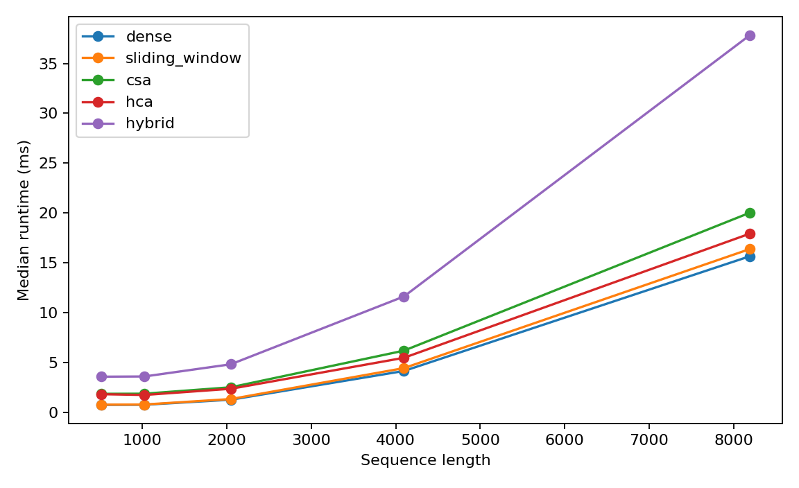

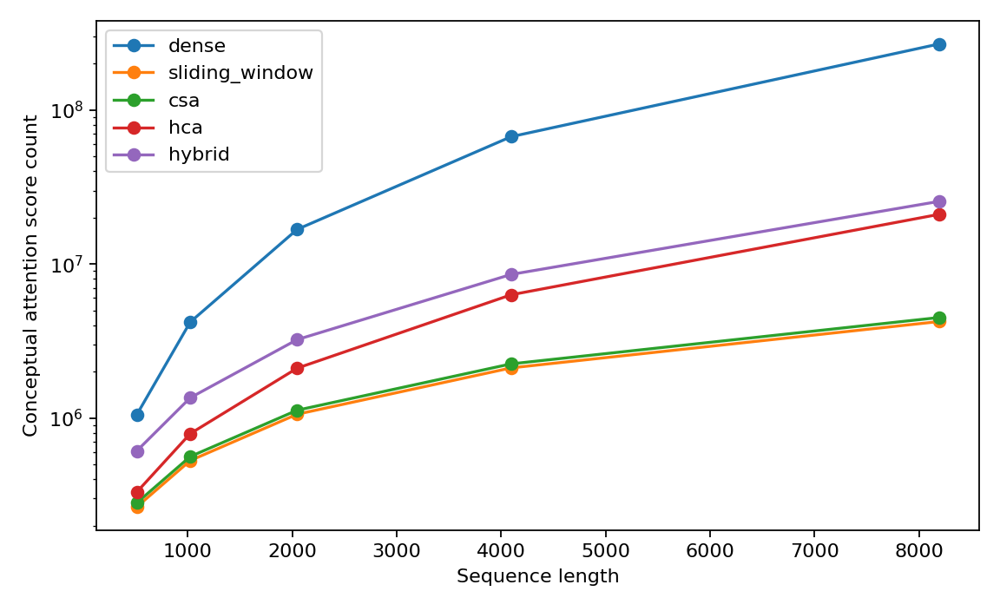

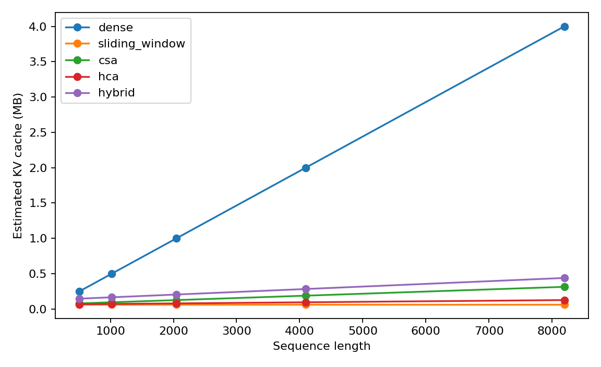

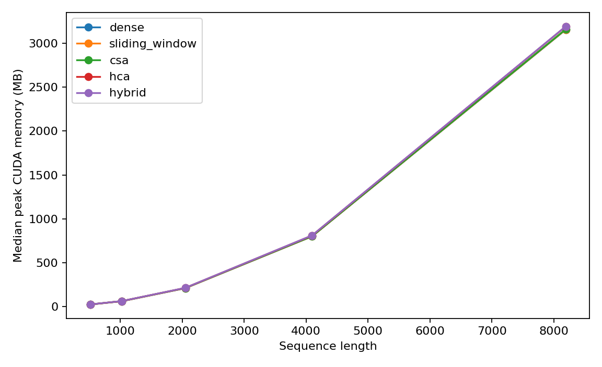

## Mechanism Diagnostics

Compression signal retention at sequence length 8192 with `noise_std=0.2`:

| compression_ratio | mean_cosine | mean_relative_signal |
| --- | ---: | ---: |
| 4 | 0.4040 | 0.25067 |
| 8 | 0.2999 | 0.12613 |
| 16 | 0.2112 | 0.06105 |
| 32 | 0.1601 | 0.03284 |
| 64 | 0.1106 | 0.01584 |
| 128 | 0.0927 | 0.00933 |

Top-k target recall at sequence length 8192 with `noise_std=0.2` and `distractor_strength=0.75`:

| compression_ratio | top4 | top8 | top16 | top32 |
| --- | ---: | ---: | ---: | ---: |
| 4 | 0.8844 | 0.9366 | 0.9676 | 0.9859 |
| 16 | 0.9558 | 0.9822 | 0.9932 | 0.9981 |
| 64 | 0.9885 | 0.9973 | 0.9996 | 0.9999 |
| 128 | 0.9951 | 0.9993 | 1.0000 | 1.0000 |

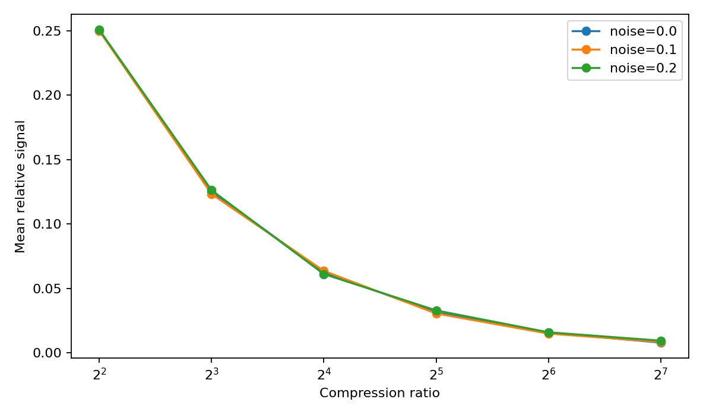

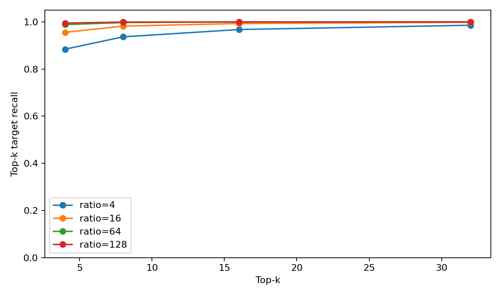

## Tiny-LM Validation Loss

Mean +/- sample standard deviation over seeds 2026, 2027, 2028:

| task | dense | sliding_window | csa | hca | hybrid |
| --- | ---: | ---: | ---: | ---: | ---: |
| local | 1.2308 +/- 0.0024 | 1.2314 +/- 0.0025 | 1.2333 +/- 0.0032 | 1.2323 +/- 0.0033 | 1.2316 +/- 0.0022 |
| copy_first | 4.8767 +/- 0.0387 | 4.8784 +/- 0.0411 | 4.8534 +/- 0.0297 | 4.8533 +/- 0.0285 | 4.8866 +/- 0.0473 |
| associative_recall | 4.3510 +/- 0.0567 | 4.3644 +/- 0.0623 | 4.3381 +/- 0.0528 | 4.3232 +/- 0.0529 | 4.3322 +/- 0.0967 |
| multi_query_retrieval | 4.1978 +/- 0.0071 | 4.1994 +/- 0.0072 | 4.1939 +/- 0.0072 | 4.1921 +/- 0.0071 | 4.2027 +/- 0.0084 |

## Tiny-LM Validation Accuracy

Mean +/- sample standard deviation over seeds 2026, 2027, 2028:

| task | dense | sliding_window | csa | hca | hybrid |
| --- | ---: | ---: | ---: | ---: | ---: |
| local | 0.333 +/- 0.003 | 0.333 +/- 0.003 | 0.334 +/- 0.003 | 0.330 +/- 0.002 | 0.331 +/- 0.004 |
| copy_first | 0.010 +/- 0.009 | 0.010 +/- 0.009 | 0.000 +/- 0.000 | 0.000 +/- 0.000 | 0.010 +/- 0.009 |
| associative_recall | 0.010 +/- 0.018 | 0.016 +/- 0.027 | 0.010 +/- 0.009 | 0.010 +/- 0.009 | 0.016 +/- 0.027 |
| multi_query_retrieval | 0.017 +/- 0.008 | 0.015 +/- 0.005 | 0.020 +/- 0.008 | 0.022 +/- 0.009 | 0.022 +/- 0.004 |

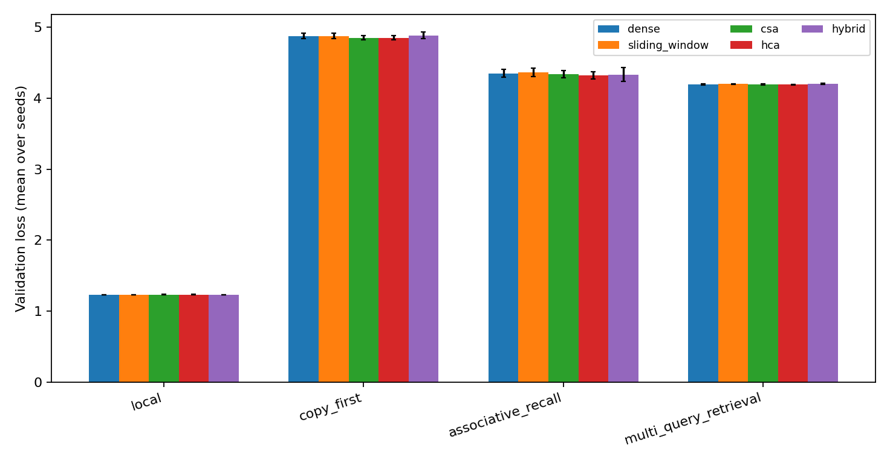

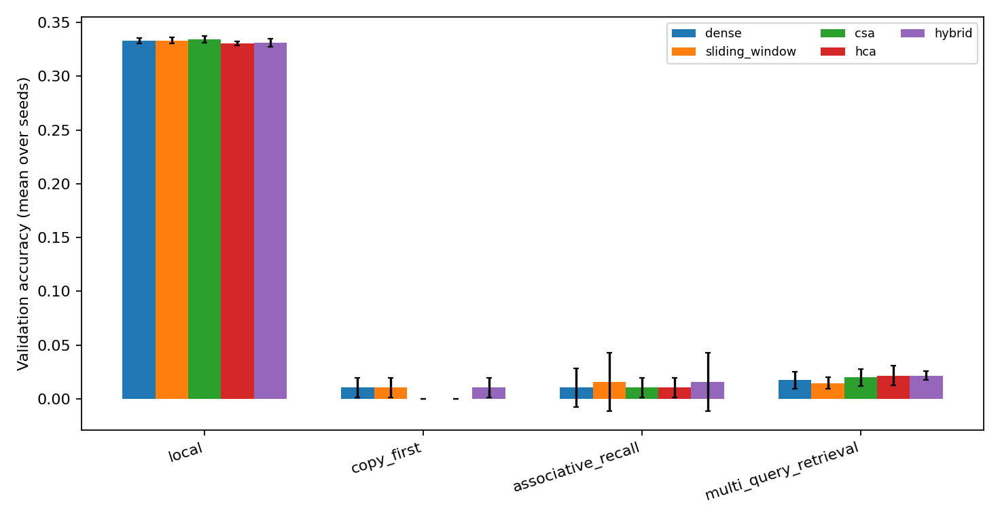

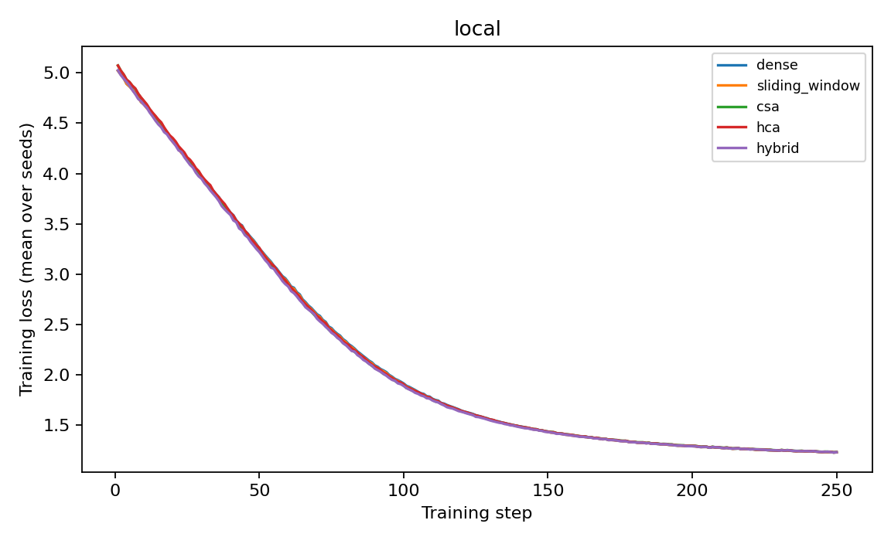

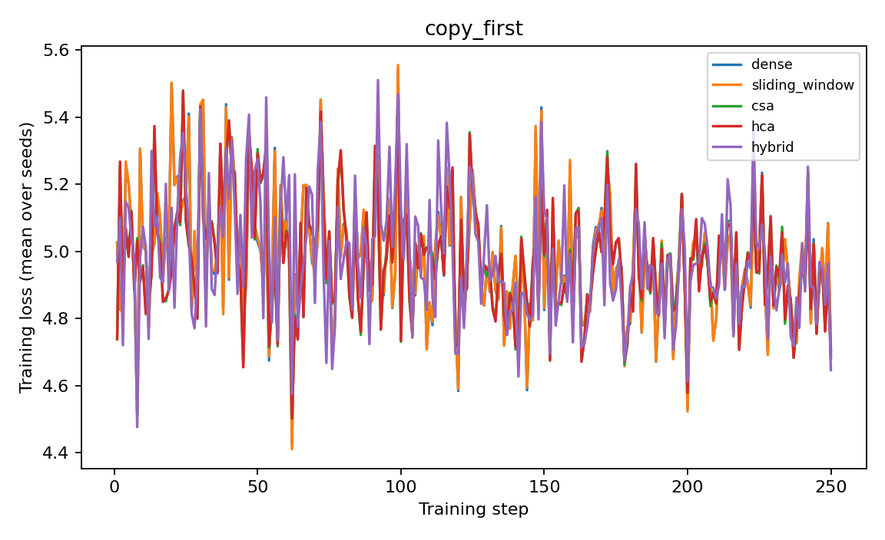

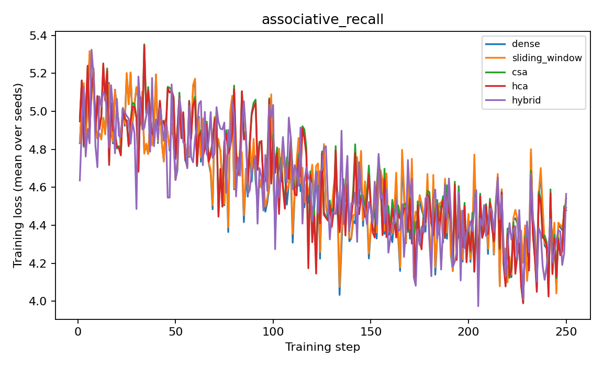

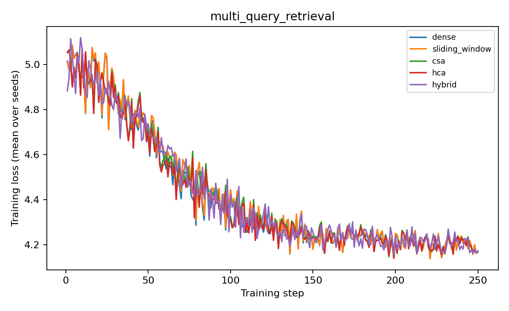

## Readout

The microbenchmark again shows the difference between theoretical score-count reduction and pure PyTorch reference runtime. Dense attention is still fastest at several lengths because the dense matrix multiplications are highly optimized. CSA and HCA reduce conceptual attention-score count and KV-cache estimates, but their current reference implementations pay overhead for compression, indexing, gather, masking, and branch merging.

The diagnostics show the expected compression tradeoff. A single salient token's relative signal drops roughly with compression ratio, especially under noise. Top-k recall is strong when the query is clean or top-k is large, but it degrades under distractor mixing for aggressive compression or small top-k. This is the main mechanism-level risk for CSA-like sparse selection.

The tiny-LM tasks separate local learning from long-range retrieval more clearly than the old random-background retrieval loss. The local task learns consistently across all attention variants. The sparse-label long-range tasks remain difficult under this small model and 250-step budget: validation accuracies are low and differences across attention types are not strong enough to support model-quality claims. These runs are useful as controlled sanity checks, not as evidence of production DeepSeek quality.
